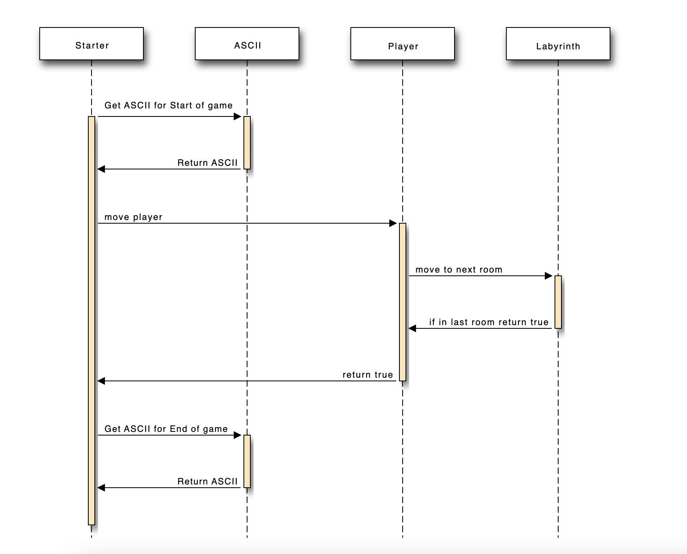
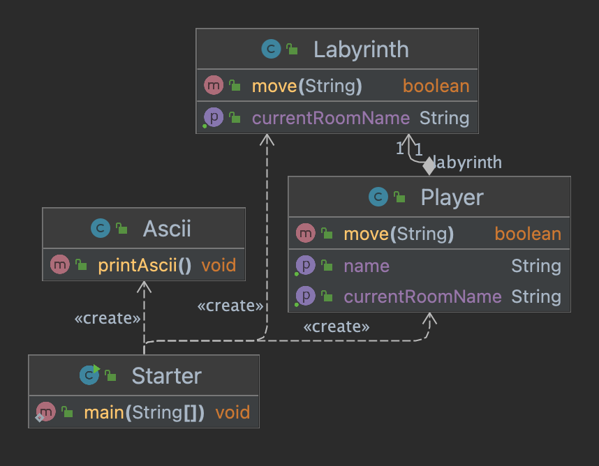

# Shitty Swedish Viking Labyrinth

## Use Case

Spieler startet die Applikation -> ASCII-Bild wird in der Konsole dargestellt. Spieler bewegt sich vorwärts. Wenn der Spieler im letzten Zimmer ist, dann ist das Spiel zu Ende und in der Konsole wird ein weiteres ASCII-Bild dargestellt.

## Sequenzdiagramm

## Klassendiagramm

## Arbeitsschritte

- Ich habe zuerst ein Grundkonzept aufgestellt mit einer Klasse
- Danach habe ich die einzelnen Komponenten Labyrinth und Player als eigene Klassen gestaltet 
- Um schön Ascii darstellen zu können habe ich eine Klasse Ascii erstellt die mit einer Funktion in der Konsole ASCII generiert
- Als Abschluss habe ich eine Starter-Methode erstellt, die alles zusammenbringt

## Testfälle

| ID | Expected                                                                                                        | Result                                                                                                          |
|----|-----------------------------------------------------------------------------------------------------------------|-----------------------------------------------------------------------------------------------------------------|
| 1  | Game starts                                                                                                     | Game starts                                                                                                     |
| 2  | ASCII Introduction displays                                                                                     | ASCII Introduction displayed                                                                                    |
| 3  | Player starts in the first room                                                                                 | Player starts in the first room                                                                                 |
| 4  | Player moves forward when typing the right direction                                                            | Player moves forward when typing the right direction                                                            |
| 5  | Player stays in first room if he types the wrong direction                                                      | Player stays in the first room if he types the wrong direction                                                  |
| 6  | Player moves back a room if he enters the wrong direction in a room further ahead than the first room           | Player moves back a room if he enters the wrong direction in a room further ahead than the first room           |
| 7  | Entering something else than a direction gives back “Not a valid input” and asks the Player to repeat the input | Entering something else than a direction gives back “Not a valid input” and asks the Player to repeat the input |
| 7  | The game ends if the player reaches the last room                                                               | The game ends if the player reaches the last room                                                               |
| 8  | ASCII end text is displayed if the last room is reached                                                         | ASCII end text is displayed if the last room is reached                                                         |
